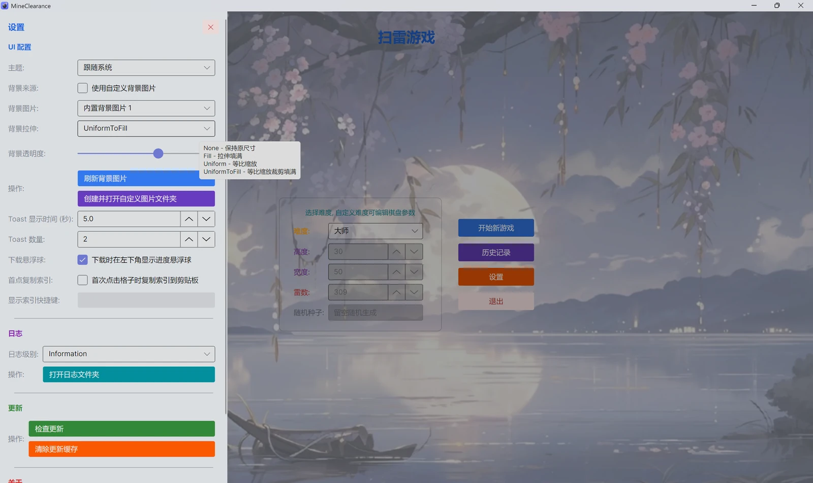
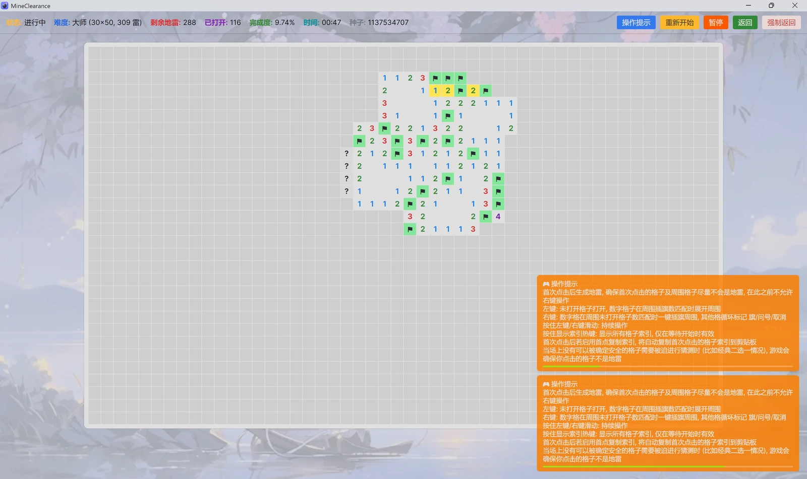
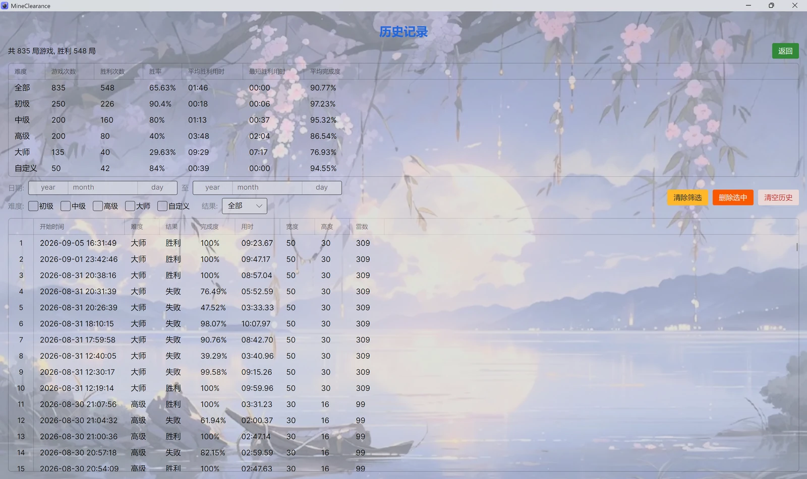
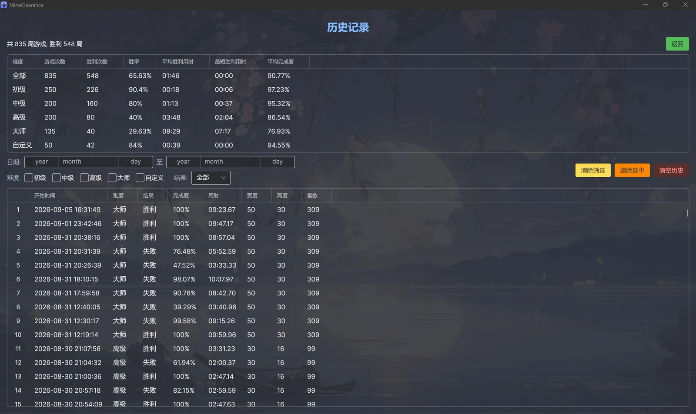

<div align="center">

# 💣 MineClearance

**English** | [简体中文](README.md)

A cross-platform Minesweeper game built with **Avalonia UI** — no install · progress restore · no-guess mode · reproducible seeds

Built on **Clean Architecture** with **.NET 10.0** — ready to play out of the box, with automatic updates.

[](LICENSE)
[](https://dotnet.microsoft.com/)
[](https://avaloniaui.net/)
[](https://github.com/xiting910/MineClearance/releases)
[](https://github.com/xiting910/MineClearance/releases)

[](https://github.com/xiting910/MineClearance/releases)
[](https://github.com/xiting910/MineClearance/releases)
[](https://github.com/xiting910/MineClearance/releases)

[](https://github.com/xiting910/MineClearance/actions/workflows/ci.yml)
[](https://github.com/xiting910/MineClearance/actions/workflows/codeql-analysis.yml)
[](https://github.com/xiting910/MineClearance/actions/workflows/dependency-review.yml)

</div>

---

> 🌐 **Language notice** — The game UI is currently **Chinese only** and does **not** support multiple languages. This English README is a courtesy translation that may lag behind the [Chinese original](README.md), which is the only version the author maintains. Pull requests are very welcome — especially ones that add UI localization.

---

## 📸 Screenshots

<div align="center">







</div>

---

## ✨ Features

### 🎮 Gameplay

- 🎮 **Classic Minesweeper** — left click to reveal (numbers auto-expand), right click to flag/question mark, one-click flagging on satisfied numbers, hold and drag for continuous play
- ⚠️ **Warning numbers** — a number turns yellow in real time when the flags around it outnumber the actual mines
- 🎯 **No-guess experience** — conditional rescue: mines are re-arranged under constraints only when a guess is forced (already-revealed numbers stay unchanged), and the rescue is refused — the loss stands — when the board contains a guaranteed-safe or guaranteed-dead cell
- 💡 **Loss review** — a lost board reveals mines, wrong flags and guaranteed-safe cells (green ✓), so you can see exactly where it went wrong
- 🎚️ **Multiple difficulties** — Beginner / Intermediate / Expert / Master, plus custom rows, columns, mines and seed (a fixed minefield is reproducible)
- 🔢 **Cell indices** — hold a hotkey to show every cell index, the first click copies it automatically, and the hotkey is recordable
- ⏸️ **Auto pause** — the game pauses automatically when a drawer is open or the window is minimized or loses focus

### ⚙️ Convenience

- 👋 **First-run guide** — welcome message and operation tips, dismissed automatically after being shown
- 💾 **Auto save** — a game in progress is saved when the window closes or you leave the game view
- 📂 **Progress restore** — restore your last game from the main view with one click (minefield, revealed cells and timer continue); the save is a single file you can back up or share
- 📊 **History & stats** — per-difficulty statistics (win rate, time, completion), filters by date/difficulty/result, sortable columns, delete selected and clear all with confirmation
- 🎨 **Theme switching** — follow system / light / dark, applied instantly and saved automatically
- 🖼️ **Background images** — 3 built in, plus custom images from your Pictures folder (stretch mode and opacity adjustable; refresh manually after adding new ones)
- ⚙️ **Settings drawer** — live configuration of theme, background, toast, log level and floating ball; manual update check; clear update cache; about info
- 🔄 **Automatic updates** — checks GitHub in the background on startup, resumable download with verification, progress floating ball and detail drawer, automatic rollback on failure
- 🔁 **Single instance** — launching the app again activates the existing instance; on Windows it is forced to the front when covered or minimized
- 🛡️ **Exception handling** — unhandled exceptions are written to a dedicated log, and UI-thread exceptions raise a toast pointing to the log location

### 🔧 Engineering & quality

- 📐 **Interactive architecture diagram** — [Architecture.html](docs/Architecture.html)
- 🧱 **Clean Architecture** — Core / Infrastructure / UI layers, high cohesion and low coupling
- 🧩 **MVVM** — CommunityToolkit.Mvvm source generators
- 📝 **Structured logging** — ILogger + LoggerMessage source generators
- 🧪 **Unit tests** — all three layers (Core / Infrastructure / UI) with xUnit v3 + Moq
- 🔁 **CI/CD automation** — automatic build, test, CodeQL analysis and Release publishing
- 📦 **Automated dependency updates** — Dependabot grouping strategy

---

## 🛠️ Tech stack

| Category     | Technology                                            |
| ------------ | ----------------------------------------------------- |
| Runtime      | .NET 10 · C# 14                                       |
| UI framework | Avalonia 12 · CommunityToolkit.Mvvm                   |
| Architecture | Clean Architecture · MVVM                             |
| Testing      | xUnit v3 · Moq · 388 unit tests                       |
| Tooling      | GitHub Actions · CodeQL · Dependabot · Central Package Management |

---

## 🚀 Getting started

> 💡 Don't want to build it yourself? Grab the portable archive for your platform from [Releases](https://github.com/xiting910/MineClearance/releases) and just unzip it.

### Requirements

- [.NET 10.0 SDK](https://dotnet.microsoft.com/download/dotnet/10.0)

### Clone

```bash
git clone https://github.com/xiting910/MineClearance.git
```

### Run

```bash
dotnet run --project srcs/MineClearance.UI
```

### Build

```bash
dotnet build
```

### Run tests

```bash
dotnet test
```

---

## 🤝 Issues & contributing

- 🐛 **Report a bug** — found a bug or have a suggestion? Open an [issue](https://github.com/xiting910/MineClearance/issues/new/choose) (bug report and feature request templates are included)
- 🚀 **Contribute code** — fork the repository and send a [PR](https://github.com/xiting910/MineClearance/pulls); CI and CodeQL keep watch automatically
- 🌐 **Help translate** — the UI and documentation are Chinese only. PRs that add UI localization or improve this English README are genuinely welcome; the author maintains the Chinese version only
- 📖 **Changelog** — release history lives in [CHANGELOG.md](CHANGELOG.md) (written in Chinese)
- ⭐ **Support the project** — if you find it useful, a star is appreciated~

---

## 📄 License

This project is licensed under the [MIT License](LICENSE).
